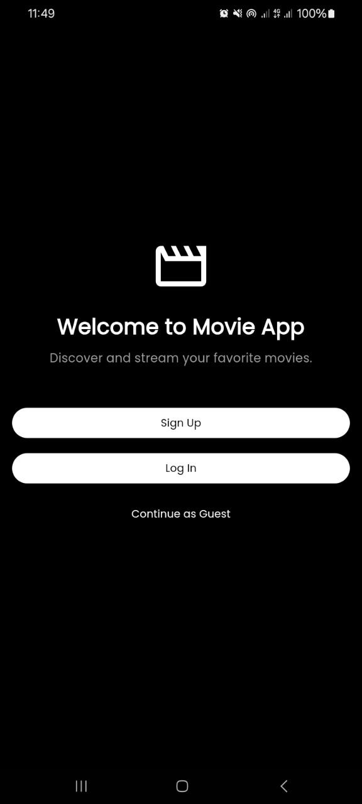
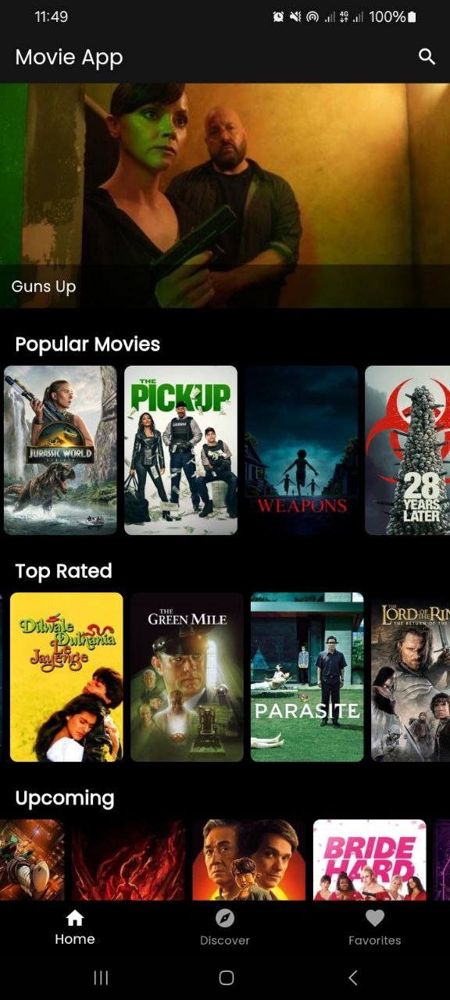
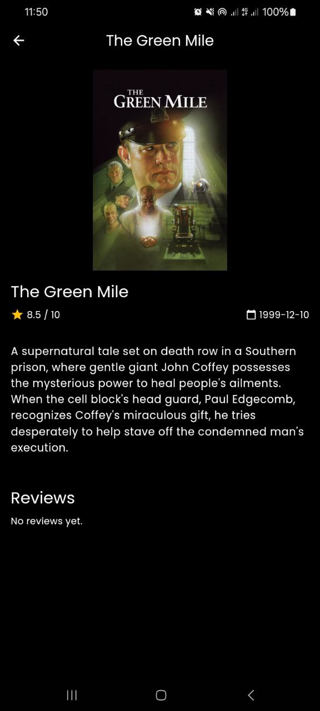
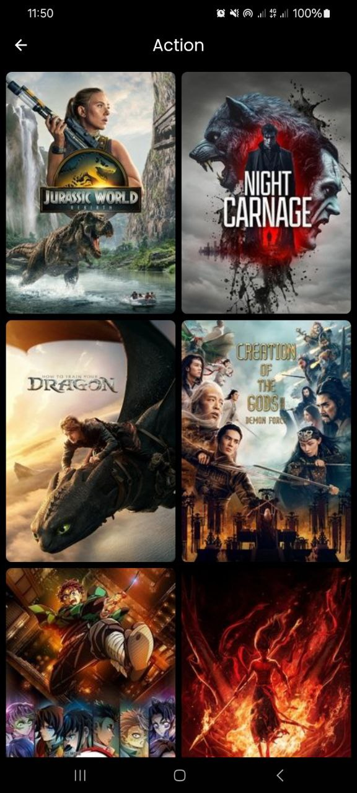
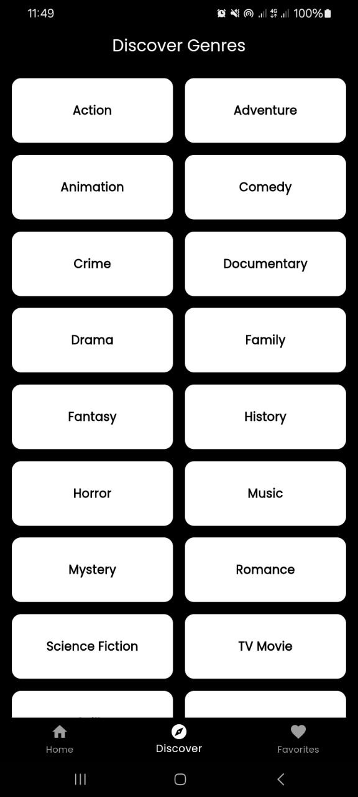
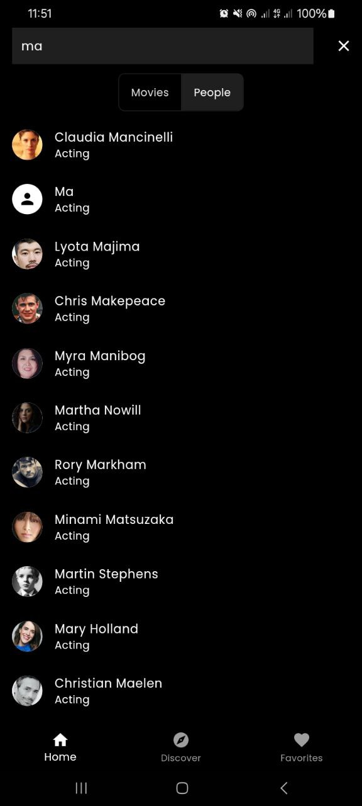
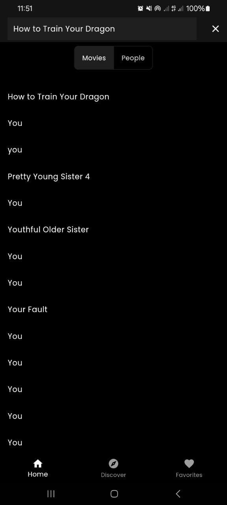

# Movie App 🎬

A sleek and modern movie application built with Flutter. Discover new movies, get details, and manage your watchlist.

## ✨ Features

- **Browse Movies**: Explore lists of popular, top-rated, and upcoming movies.
- **Movie Details**: View detailed information for any movie, including synopsis, cast, and ratings.
- **Search**: Quickly find any movie by title.
- **User Authentication**: Sign up and log in to manage your personal account.
- **Watchlist**: Add or remove movies from your personal watchlist.

*(You can add or remove features from this list)*

## 📸 Screenshots

| Login Screen | Home Screen | Movie Details |
| :----------: | :---------: | :-----------: |
<p align="center">
  
  
   
   
    
  
   
   
</p>


## 🛠️ Tech Stack & Dependencies

- **Framework**: [Flutter](https://flutter.dev/)
- **State Management**: [GetX](https://pub.dev/packages/get)
- **Backend & Authentication**: [Firebase](https://firebase.google.com/)
- **API**: [The Movie Database (TMDb)](https://www.themoviedb.org/documentation/api) *(Please confirm this)*
- **Environment Variables**: [flutter_dotenv](https://pub.dev/packages/flutter_dotenv)

## 🚀 Getting Started

To get a local copy up and running, follow these simple steps.

### Prerequisites

- Flutter SDK: [https://flutter.dev/docs/get-started/install](https://flutter.dev/docs/get-started/install)
- A Firebase project with Authentication enabled.
- An API key from a movie database like TMDb.

### Installation

1.  Clone the repo
    ```sh
    git clone https://github.com/your_username/movie_app.git
    ```
2.  Install packages
    ```sh
    flutter pub get
    ```
3.  Set up your environment variables by creating a `.env` file in the root of the project and adding your keys:
    ```
    API_KEY='YOUR_API_KEY'
    ```
4.  Run the app
    ```sh
    flutter run
    ```

## License

Distributed under the MIT License. See `LICENSE` for more information.


A new Flutter project.

## Getting Started

This project is a starting point for a Flutter application.

A few resources to get you started if this is your first Flutter project:

- [Lab: Write your first Flutter app](https://docs.flutter.dev/get-started/codelab)
- [Cookbook: Useful Flutter samples](https://docs.flutter.dev/cookbook)

For help getting started with Flutter development, view the
[online documentation](https://docs.flutter.dev/), which offers tutorials,
samples, guidance on mobile development, and a full API reference.
